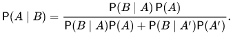

# Kierunkowskaz

Nasza aplikacja zada użytkownikowi kilka pytań na temat jego
preferencji w temacie nauki, życia i kilku innych cech i na
podstawie odpowiedzi zaproponuje 5 najlepiej dopasowanych 
kierunków studiów.

## Jak to się dzieje?
Żeby uzyskać powyżej przedstawiony efekt korzystamy z **twierdzenia
Bayesa**. Wiedząc że 90% studentów matematyki lubi przedmioty ścisłe
możemy policzyć prawdopodobieństwo tego że ktoś będzie stduiował
informatykę lubiąc przedmioty ścisłe korzystając ze wzoru: 
  
Gdzie:
P(A|B) - Prawdopodobieństwo tego że ktoś będzie stduiował
informatykę lubiąc przedmioty ścisłe  
P(B|A) - Prawdopodobieństwo tego że ktoś lubi przedmioty ścisłe
studiując informatykę  
P(A) - Prawdopodobieństwo że dany kierunek studiów to 
informatyka  
P(B|A') - Prawdopodobieństwo tego że ktoś lubi przedmioty ścisłe
nie studiując informatyki  
P(A') - Prawdopodobieństwo że dany kierunek studiów to nie jest
informatyka  

## Jak dobieramy pytania
[Entropia :))](https://pl.wikipedia.org/wiki/Entropia_(teoria_informacji))
 
(Szukamy pytania które da największy spadek entropi.)
